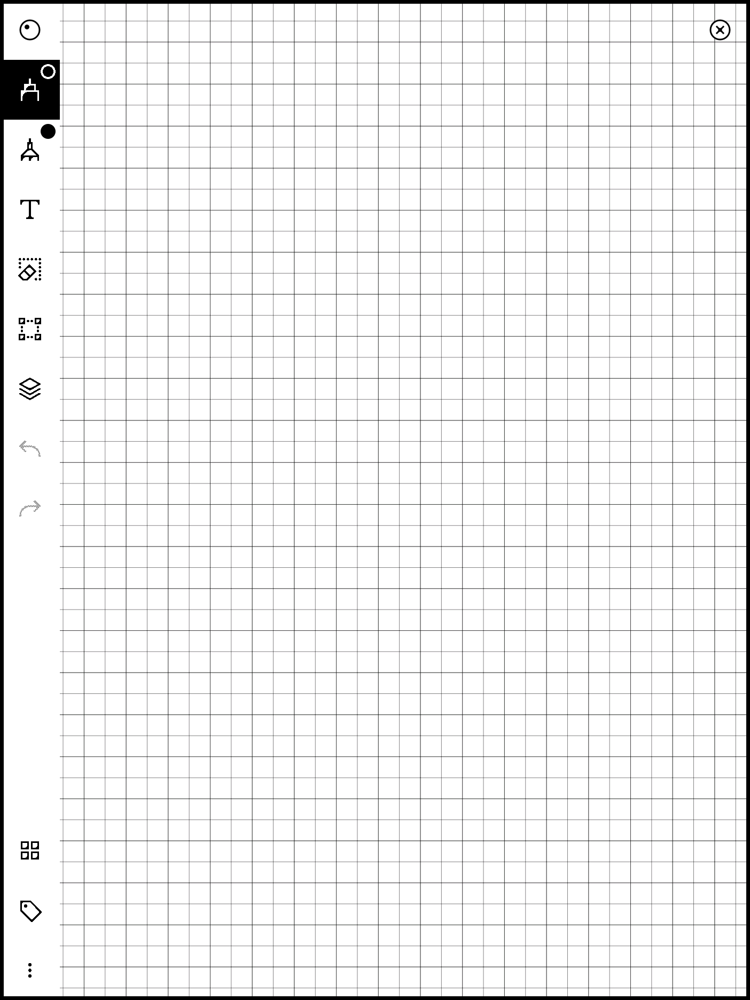

# reMarkable Hanzi Grids

Custom note templates for practicing Chinese character writing on the reMarkable.

- **Tian Zi Ge** (田字格): a grid divided into four quadrants.
- **Mi Zi Ge** (米字格): a grid with eight guide sectors.

Both templates tile a single repeating cell across the page and work in both portrait and landscape.

## Table of Contents

- [Previews](#previews)
- [Installation](#installation)
- [License](#license)

## Previews

### Tian Zi Ge


### Mi Zi Ge


## Installation

Tested on a reMarkable 2 running software version **3.27.10**.

1. **Enable SSH** on the device. See the [reMarkable SSH guide](https://remarkable.guide/guide/access/ssh.html).
2. **Copy the template files** to the templates directory:

   ```bash
   scp templates/tianzige.template templates/mizige.template root@<remarkable-ip>:/usr/share/remarkable/templates/
   ```

3. **Update `templates.json`** on the device. Open `/usr/share/remarkable/templates/templates.json` in vim and merge in the two entries from [`templates.json`](templates.json), keeping the `templates` array valid JSON.

   ```bash
   ssh root@<remarkable-ip> 'vim /usr/share/remarkable/templates/templates.json'
   ```

4. Restart the UI on the device so the templates appear in the template picker:

   ```bash
   ssh root@<remarkable-ip> 'systemctl restart xochitl'
   ```

The new grids will then be available under their named entries.

## License

Copyright (C) 2026 Salvatore Catroppa. Licensed under the [GNU GPLv3](COPYING).

reMarkable and all other trademarks are the property of their respective owners.
